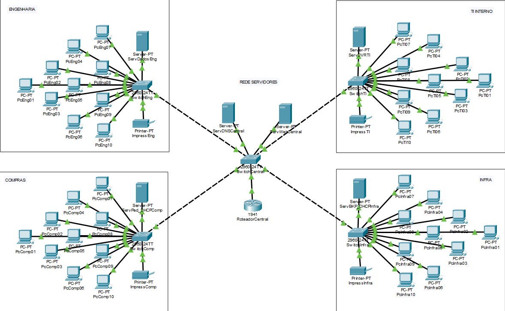
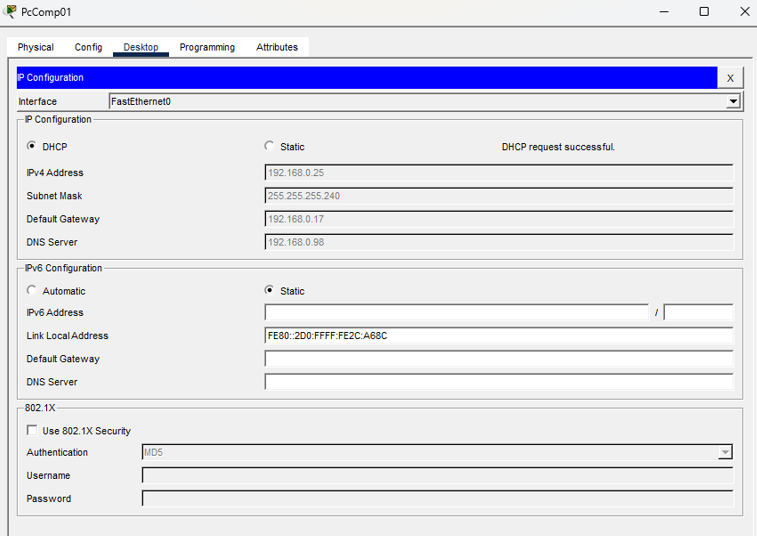
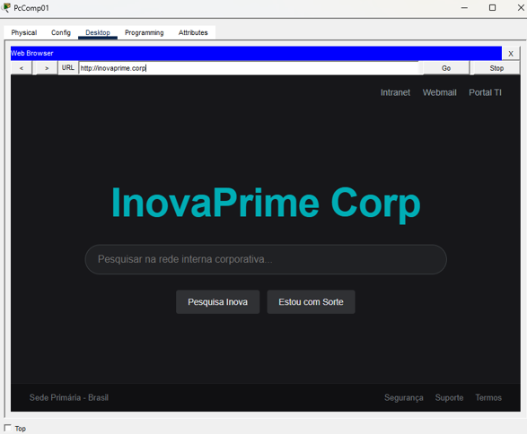
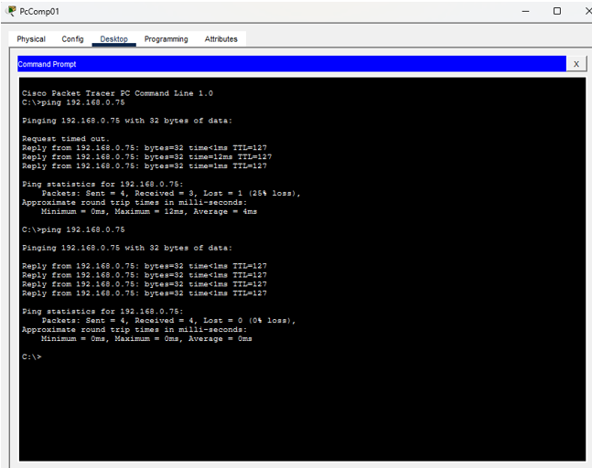

# Projeto Cisco Packet Tracer: Rede Corporativa InovaPrime Corp

Projeto de infraestrutura de rede simulando a expansão da sede de uma empresa fictícia (InovaPrime Corp), aplicando segmentação por VLANs, VLSM, roteamento inter-VLAN (Router-on-a-Stick) e serviços de rede (DHCP, DNS e Web).

> Desafio proposto por uma IA como exercício prático após a conclusão dos cursos de Fundamentos de Redes e Cisco Packet Tracer.

## Sumário

- [Contexto do Desafio](#contexto-do-desafio)
- [Conceitos e Tecnologias Aplicados](#conceitos-e-tecnologias-aplicados)
- [Planejamento de Endereçamento IP e VLANs](#planejamento-de-endereçamento-ip-e-vlans)
- [Mapeamento de VLANs](#mapeamento-de-vlans)
- [Topologia da Rede](#topologia-da-rede)
- [Mapeamento de Dispositivos](#mapeamento-de-dispositivos)
- [Mapeamento de Switches](#mapeamento-de-switches)
- [Configuração de Serviços (DHCP, DNS, Web)](#configuração-de-serviços-dhcp-dns-web)
- [Configuração do Roteador (Router-on-a-Stick)](#configuração-do-roteador-router-on-a-stick)
- [DHCP Relay (ip helper-address)](#dhcp-relay-ip-helper-address)
- [Testes e Validação](#testes-e-validação)
- [Conclusão](#conclusão)

## Contexto do Desafio

A empresa fictícia **InovaPrime Corp** está expandindo sua sede corporativa e precisa de um analista de infraestrutura para projetar e homologar a nova rede local (LAN). O projeto exige total isolamento de tráfego entre os setores, gerência centralizada e comunicação controlada através de um roteador corporativo.

**Estrutura física:** 4 departamentos (Engenharia, Compras, T.I. Interno, Infraestrutura), cada um com switch dedicado e 2 VLANs (Colaboradores e Serviços do Setor).

**Distribuição de hosts por departamento:**

| Departamento | VLAN A (Colaboradores) | VLAN B (Serviços) |
|---|---|---|
| Engenharia | 10 estações | 1 impressora + 1 servidor de arquivos |
| Compras | 10 estações | 1 impressora + 1 servidor de pedidos |
| T.I. Interno | 10 estações | 1 impressora + 1 servidor de monitoramento |
| Infraestrutura | 10 estações | 1 impressora + 1 servidor de backup |

**Regras de endereçamento:**
- Engenharia e T.I. Interno: IP estático em todos os dispositivos.
- Compras e Infraestrutura: IP dinâmico (DHCP) nas estações; servidores e impressoras com IP estático.
- Servidor Web e DNS corporativo centralizado em VLAN exclusiva, acessível por todos os setores via `http://inovaprime.corp`.

## Conceitos e Tecnologias Aplicados

- Topologia e design de redes (estrela hierárquica)
- Segmentação de rede com VLANs
- Endereçamento lógico: classes de IP, máscaras de sub-rede, CIDR
- VLSM (Variable Length Subnet Mask)
- Roteamento de camada 3 com Router-on-a-Stick
- DHCP (dinâmico e estático) e DHCP Relay (`ip helper-address`)
- Serviços de DNS e Web (HTTP)

## Planejamento de Endereçamento IP e VLANs

Bloco privado de Classe C utilizado: `192.168.0.0/24`.

### Setor Engenharia

| Rede | Broadcast | CIDR | Máscara | Faixa de Hosts | Gateway | DHCP | VLAN |
|---|---|---|---|---|---|---|---|
| 192.168.0.0 | 192.168.0.15 | /28 | 255.255.255.240 | .1 a .14 | 192.168.0.1 | Estático | (A) 100 |
| 192.168.0.64 | 192.168.0.71 | /29 | 255.255.255.248 | .65 a .70 | 192.168.0.65 | Estático | (B) 200 |

### Setor Compras

| Rede | Broadcast | CIDR | Máscara | Faixa de Hosts | Gateway | DHCP | VLAN |
|---|---|---|---|---|---|---|---|
| 192.168.0.16 | 192.168.0.31 | /28 | 255.255.255.240 | .17 a .30 | 192.168.0.17 | Dinâmico | (A) 300 |
| 192.168.0.72 | 192.168.0.79 | /29 | 255.255.255.248 | .73 a .78 | 192.168.0.73 | Estático | (B) 400 |

### Setor T.I. Interno

| Rede | Broadcast | CIDR | Máscara | Faixa de Hosts | Gateway | DHCP | VLAN |
|---|---|---|---|---|---|---|---|
| 192.168.0.32 | 192.168.0.47 | /28 | 255.255.255.240 | .33 a .46 | 192.168.0.33 | Estático | (A) 500 |
| 192.168.0.80 | 192.168.0.87 | /29 | 255.255.255.248 | .81 a .86 | 192.168.0.81 | Estático | (B) 600 |

### Setor Infraestrutura

| Rede | Broadcast | CIDR | Máscara | Faixa de Hosts | Gateway | DHCP | VLAN |
|---|---|---|---|---|---|---|---|
| 192.168.0.48 | 192.168.0.63 | /28 | 255.255.255.240 | .49 a .62 | 192.168.0.49 | Dinâmico | (A) 700 |
| 192.168.0.88 | 192.168.0.95 | /29 | 255.255.255.248 | .89 a .94 | 192.168.0.89 | Estático | (B) 800 |

### Rede Servidores Centrais

| Rede | Broadcast | CIDR | Máscara | Faixa de Hosts | Gateway | DHCP | VLAN |
|---|---|---|---|---|---|---|---|
| 192.168.0.96 | 192.168.0.103 | /29 | 255.255.255.248 | .97 a .102 | 192.168.0.97 | Estático | 900 |

## Mapeamento de VLANs

| VLAN ID | Nome | Setor/Switch | Portas | Dispositivos |
|---|---|---|---|---|
| 100 | Engenharia - Colaboradores | Switch Engenharia | 01-12 | 10 estações |
| 200 | Engenharia - Serviços | Switch Engenharia | 13-24 | Impressora, Servidor de Arquivos |
| 300 | Compras - Colaboradores | Switch Compras | 01-12 | 10 estações |
| 400 | Compras - Serviços | Switch Compras | 13-24 | Impressora, Servidor de Pedidos |
| 500 | T.I Interno - Colaboradores | Switch T.I | 01-12 | 10 estações |
| 600 | T.I Interno - Serviços | Switch T.I | 13-24 | Impressora, Servidor de Monitoramento |
| 700 | Infraestrutura - Colaboradores | Switch Infraestrutura | 01-12 | 10 estações |
| 800 | Infraestrutura - Serviços | Switch Infraestrutura | 13-24 | Impressora, Servidor de Backup |
| 900 | Servidores Centrais | Switch Central | 05-06 | DNS/Web |

## Topologia da Rede

Topologia em **estrela hierárquica**: cada departamento possui um switch dedicado conectado via trunk a um Switch Central, que por sua vez se conecta ao Roteador Central (Router-on-a-Stick) e hospeda os servidores de DNS/Web centralizados.

A vantagem desse modelo é o isolamento de falhas: a queda de uma estação ou periférico individual não compromete o restante da rede.



## Mapeamento de Dispositivos

Tabela completa com ID, VLAN, modo de DHCP, IP, máscara, gateway, DNS e porta de switch para cada dispositivo, organizada por setor (Engenharia, Compras, T.I. Interno, Infraestrutura, Central).

> Tabela completa disponível em [`docs/dispositivos.md`](docs/dispositivos.md) (ou na documentação completa em PDF/DOCX anexada ao repositório).

## Mapeamento de Switches

Cada switch de setor possui portas de acesso (1-10 para colaboradores, 13-14 para serviços) e uma porta trunk (Gig0/1) para o Switch Central. O Switch Central, por sua vez, possui 4 portas trunk para os switches de setor, 2 portas de acesso para os servidores centrais (VLAN 900) e 1 porta trunk para o roteador.

> Tabela completa de portas, modos e cabos disponível em [`docs/switches.md`](docs/switches.md).

## Configuração de Serviços (DHCP, DNS, Web)

### DHCP — Rede Compras

| PoolName | Default Gateway | DNS Server | Start IP | Subnet Mask |
|---|---|---|---|---|
| VLAN_300 | 192.168.0.17 | 192.168.0.98 | 192.168.0.18 | 255.255.255.240 |

### DHCP — Rede Infraestrutura

| PoolName | Default Gateway | DNS Server | Start IP | Subnet Mask |
|---|---|---|---|---|
| VLAN_700 | 192.168.0.49 | 192.168.0.98 | 192.168.0.50 | 255.255.255.240 |

### DNS Service

| Nome | Endereço |
|---|---|
| inovaprime.corp | 192.168.0.99 |

### Web Service

Página corporativa servida em `http://inovaprime.corp`, com layout customizado em HTML/CSS (modo escuro). Código-fonte disponível em [`web/index.html`](web/index.html).

## Configuração do Roteador (Router-on-a-Stick)

Para permitir a comunicação entre as 9 VLANs do projeto, foi implementado o método **Router-on-a-Stick** no Roteador Central, criando uma sub-interface lógica para cada VLAN dentro da interface física `GigabitEthernet0/0`.

```
enable
configure terminal
interface GigabitEthernet 0/0
 no shutdown
exit

! === SETOR ENGENHARIA ===
interface GigabitEthernet 0/0.100
 encapsulation dot1Q 100
 ip address 192.168.0.1 255.255.255.240
exit

interface GigabitEthernet 0/0.200
 encapsulation dot1Q 200
 ip address 192.168.0.65 255.255.255.248
exit

! === SETOR COMPRAS ===
interface GigabitEthernet 0/0.300
 encapsulation dot1Q 300
 ip address 192.168.0.17 255.255.255.240
exit

interface GigabitEthernet 0/0.400
 encapsulation dot1Q 400
 ip address 192.168.0.73 255.255.255.248
exit

! === SETOR T.I. INTERNO ===
interface GigabitEthernet 0/0.500
 encapsulation dot1Q 500
 ip address 192.168.0.33 255.255.255.240
exit

interface GigabitEthernet 0/0.600
 encapsulation dot1Q 600
 ip address 192.168.0.81 255.255.255.248
exit

! === SETOR INFRAESTRUTURA ===
interface GigabitEthernet 0/0.700
 encapsulation dot1Q 700
 ip address 192.168.0.49 255.255.255.240
exit

interface GigabitEthernet 0/0.800
 encapsulation dot1Q 800
 ip address 192.168.0.89 255.255.255.248
exit

! === REDE SERVIDORES CENTRAIS ===
interface GigabitEthernet 0/0.900
 encapsulation dot1Q 900
 ip address 192.168.0.97 255.255.255.248
exit

end
write memory
```

**O que cada bloco faz:**
- `interface GigabitEthernet 0/0.<VLAN_ID>`: cria a sub-interface lógica vinculada à VLAN.
- `encapsulation dot1Q <VLAN_ID>`: associa a sub-interface ao tráfego marcado (tagged) daquela VLAN via protocolo IEEE 802.1Q.
- `ip address <gateway> <máscara>`: define o IP que atua como gateway padrão dos dispositivos daquela VLAN.

## DHCP Relay (ip helper-address)

As VLANs 300 (Compras) e 700 (Infraestrutura) usam DHCP dinâmico, mas seus servidores DHCP ficam em VLANs diferentes (400 e 800, respectivamente). Como pedidos DHCP são broadcasts e não atravessam VLANs, foi necessário configurar o roteador como agente de retransmissão:

```
enable
configure terminal

interface GigabitEthernet 0/0.300
 ip helper-address 192.168.0.74
exit

interface GigabitEthernet 0/0.700
 ip helper-address 192.168.0.90
exit

end
write memory
```

O comando `ip helper-address` converte o broadcast do cliente em um pacote unicast direcionado ao servidor DHCP correto, permitindo que ele responda mesmo estando em outra VLAN.

## Testes e Validação

- **Conectividade Inter-VLAN (ping):** comunicação validada entre estações, servidores locais e servidores centrais, com 0% de perda de pacotes (exceto a primeira tentativa, com perda esperada de 25% por resolução ARP).
- **Endereçamento dinâmico:** estações das VLANs 300 e 700 receberam IP, máscara, gateway e DNS corretamente via DHCP Relay.
- **Serviços de aplicação:** página `http://inovaprime.corp` carregada com sucesso a partir de estações de setores diferentes, validando a integração DNS + Web.





## Conclusão

Este projeto consolidou na prática conceitos fundamentais de redes: VLANs, VLSM, roteamento inter-VLAN e serviços de infraestrutura. Durante a implementação, foi identificado um erro de alinhamento nos blocos de sub-rede (blocos que não respeitavam os múltiplos corretos de 8/16 endereços), o que impedia o funcionamento correto do DHCP dinâmico. A correção desse problema, com apoio de revisão técnica por IA, reforçou o entendimento sobre VLSM e overlapping de blocos.

O projeto também evidenciou a importância de uma documentação de rede precisa e organizada, não apenas para a montagem inicial, mas como base para manutenção e expansão futura da infraestrutura.

---

**Autor:** Amarildo Andrade de Sousa
**Ferramentas utilizadas:** Cisco Packet Tracer, draw.io (diagramas ilustrativos)
